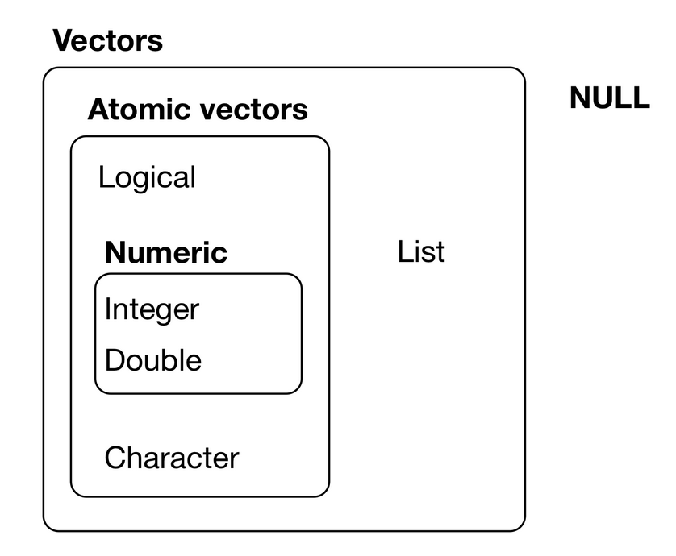
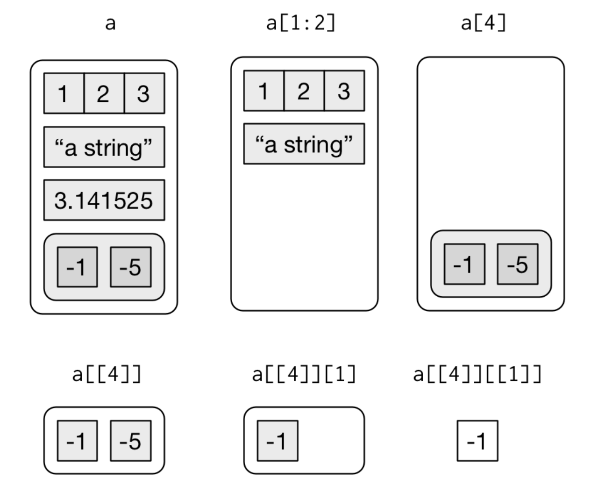

<style>
strong{
  color: #018080;
}

table.rmdtable th {
    background: -webkit-gradient(linear, 50% 0%, 50% 100%, color-stop(40%, #bbbbbb), color-stop(80%, #cccccc)) no-repeat;
}
</style>

## Agenda

1. R Programming
2. Version control with Github
3. Project work / consultations

## Setup

```{r setup, message=FALSE, warning=FALSE}
knitr::opts_chunk$set(echo = TRUE, message = FALSE, warning = FALSE)
library(tidyverse)
wine <- read_csv("../resources/winemag-data.csv") %>% 
  filter(!is.na(price)) %>%
  mutate(year = as.numeric(str_extract(title,"(\\d{4})"))) %>% 
  filter(year %in% c(2000:2015))
```


# R Programming

## Includes

```{r}
source('theme.R')
```

## Pipes {.build}

> **%>%**

- When should you use a pipe operator? 
- When shouldn't you use a pipe operator?

## Variables

```{r}
wineOregon <- wine %>% 
  filter(province=="Oregon") %>% 
  select(country, province, year, winery, region_1)
glimpse(wineOregon)

number_three <- 3
number_three

```


## Functions

- When should you use a function? 

```{r}
myf <- function(x){
  x*2-6
}
myf(24)
```

## Practice

1. Create a function that takes as input
2. a data frame, a column name, and a number
3. and returns that number of random entries for the column

*Hint:* use the 'sample_n()' function within your function

## Solution

```{r}
rand_col <- function(df, col_name, amount){
  sample_n(df,amount) %>% 
    select(col_name)
}
rand_col(wine, "title", 5)
```

## Function tips/tricks

1. Use CamelCase or snake_case
2. Be descriptive, but not overly wordy
3. Use the same prefix for related functions
4. Avoid overwriting existing common functions
5. Document with comments

## Optional arguments

```{r}
rand_col <- function(df, col_name="id", amount){
  sample_n(df,amount) %>% 
    select(col_name)
}
rand_col(wine, amount =  5)
```

*Note:* Function input order matters

## Conditionals

> if awesome, then go for it ...else, don't

```{r}
jameson="awesome"

if(jameson=="awesome"){
  print("Yeah!")
}else{
  print("boooo!")
}
```

## Practice

1. Create a function that take as input
2. A dataframe and a string
3. and returns True if there is a column name that matches the string
4. and false otherwise

*Hint:* Use the 'names()' function to get a list of column names for a dataframe

## Solution
```{r}
nf <- function(df,name){
  if(name %in% names(df)){
    TRUE
  }else{
    FALSE
  }
}

nf(df=wine,name = "Price")
```

## Pipeable functions

If in the Tidyverse... then take a dataframe and return a dataframe.

```{r}
rando_5 <- function(df){
  sample_n(df,5)
}

wine %>% 
  rando_5() %>%
  select(price, title)
```


## Vectors



## Vector properties

1. type
2. length

```{r}
typeof(1:10)
length(1:10)
```

## Vector creation and subsetting
```{r}
# unnamed
x <- c(5, NA, 3, 1, 1, 6)

# named
y <- c("Jameson"=T, "is"=T, "cool"=F)

x[c(1,2,5)] #Subset with integer vector

x[!is.na(x)] #Subset with logical vector

y[c("Jameson")] #Subset with names
```


## Recursive vectors (i.e. lists)

```{r}
z <- list(c(1,2,3), c(4,5,6)) #can take different types (not atomic)
str(z)

z[1] #extracts sublist
z[[2]] #extract a component from list (removes a level of hierarchy)
z[[2]][1]
```

## Access rules for lists




## Iteration

```{r}
df <- tibble(
  a = rnorm(10),
  b = rnorm(10),
  c = rnorm(10),
  d = rnorm(10)
)
output <- vector("double", ncol(df))  # 1. output
for (i in seq_along(df)) {            # 2. sequence
  output[[i]] <- median(df[[i]])      # 3. body
}
output
```

## More iteration

```{r}
x <- c(1,5,6,8,2,4,6)
for (i in 1:length(x)){
  print(x[[i]])
}
```

## Practice

1. Write a function called both_na()
2. that takes two vectors of the same length 
3. and returns the number of rows that have an NA in both vectors

*Hint:* You can use the is.na() function to make the check

## Solution

```{r}
both_na <- function(v1,v2){
  if(length(v1)!=length(v2)){
    return("Vectors need to be of same length.")
  }
  count = 0
  for (i in seq_along(v1)){
    if(is.na(v1[[i]]) & is.na(v2[[i]])){
      count=count+1
    }
  }
  return(count)
}

both_na(c(NA,4,5,7,NA),c(NA,6,NA,5,5))
both_na(c(NA,4,NA,7,NA),c(NA,6,NA,5,5))
```

# Version control w/ Github

## Basics

1. Do a youtube search on how to install Git
2. Create a github account
3. Download and install Github desktop

...um, why do we care about this?

