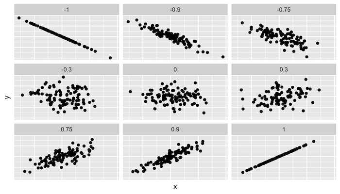
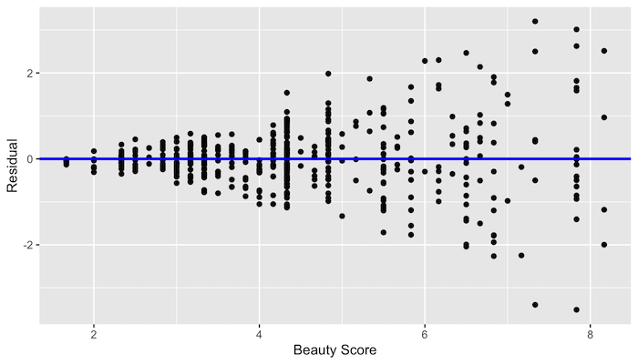

```{r setup, include=FALSE}
knitr::opts_chunk$set(echo = TRUE, message=FALSE, warning = FALSE)
```

## Agenda

1. Mid-term review
2. Basic Regression
    1. Numerical predictors
    2. Categorical predictors
    3. Residual analysis

## Environment setup
```{r}
library(tidyverse)
wine <- read_csv("../resources/winemag-data.csv") %>% 
  filter(!is.na(price)) %>%
  mutate(year = as.numeric(str_extract(title,"(\\d{4})"))) %>% 
  mutate(lprice=log(price))
```

# Mid-term Review

## Problem 10

Create bar plot that shows average rainfall from 1995 onwards.

*Hint:* you may want to mutate using if_else to change NA to 0 before summarize

## Solution
```{r, fig.height=3}
read_csv("../resources/rainfall.csv") %>% 
  pivot_longer(-Year,names_to = "month", values_to = "rainfall") %>% 
  mutate(rainfall=if_else(is.na(rainfall),0,rainfall)) %>% 
  group_by(Year) %>% 
  summarise(rainfall=mean(rainfall)) %>% 
  filter(Year >= 1995) %>% 
  ggplot(aes(Year,rainfall))+
    geom_col()
```

## Problem 11

Create a scatter (i.e., point) plot that shows the relationship between the log of september rainfall and average price for wines in the Dundee Hills region. Does it look like there is a relationship?

## Solution
```{r, fig.height=3}
read_csv("../resources/rainfall.csv") %>% 
  pivot_longer(-Year,names_to = "month", values_to = "rainfall") %>% 
  rename("year"="Year") %>% 
  filter(month=="Sep") %>% 
  right_join(wine) %>% 
  filter(region_1=="Dundee Hills") %>% 
  group_by(rainfall) %>% 
  summarise(price=mean(price)) %>% 
  ggplot(aes(log(rainfall),price))+
    geom_point()
```

## Bonus

What are the top scoring wines from the ten french wineries with the highest average prices? Only include wineries that produce 5 or more wines.

*Note:* For full credit, use 10 operations (piped lines of code) or less.

## Solution
```{r}
wine %>% 
  filter(country=="France") %>%
  group_by(winery) %>% 
  summarize(
    count=n(), 
    avg_price=mean(price)) %>% 
  filter(count>=5) %>% 
  top_n(10,avg_price) %>% 
  left_join(wine) %>%
  arrange(winery,desc(points)) %>% 
  group_by(winery) %>% 
  summarize(title=first(title), points=first(points))
```

## Alternative solution (and upgrade)

```{r}
wine %>% 
  filter(country=="France") %>%
  group_by(winery) %>% 
  mutate(
    count=n(), 
    avg_price=mean(price)) %>%
  filter(count>=5) %>% 
  arrange(winery,desc(points)) %>% 
  summarize(title=first(title), points=first(points), avg_price=first(avg_price)) %>% 
  top_n(10,avg_price)
```

# Numerical predictors

## Correlation

[*Credit:* Modern Dive](https://moderndive.com/5-regression.html)

[http://guessthecorrelation.com/](http://guessthecorrelation.com/) ...my high score is 122



## Calculating correlation

```{r}
library(moderndive)
wine %>% get_correlation(formula = price ~ points)
wine %>% summarise(correlation=cor(price,points))
wine %>% summarise(correlation=cor(lprice,points))
```

## Exercise

1. Calculate the correlation between log(price) and points 
2. by variety
3. for Oregon Chardonnay, Pinot Noir and Pinot Gris
4. in the same tibble

## Solution

```{r}
wine %>% 
  filter(province=="Oregon") %>% 
  filter(variety %in% c("Chardonnay","Pinot Noir","Pinot Gris")) %>% 
  group_by(variety) %>% 
  summarise(correlation=cor(lprice,points))
```

## Visualizing these different correlations

```{r, fig.height=3.5}
wine %>% 
  filter(province=="Oregon") %>% 
  filter(variety %in% c("Chardonnay","Pinot Noir","Pinot Gris")) %>% 
  ggplot(aes(points,lprice, color=variety)) +
    geom_point(alpha=0.3)+
    facet_wrap(~variety)+
    geom_smooth(method = lm)
    
```

## Simple linear regression

```{r}
model <- lm(lprice~points, filter(wine,province=="Oregon"))
get_regression_table(model)
```

## Interpreting the coefficients

```{r}
pct = (exp(coef(model)["points"]) - 1) * 100
```

Since we logged the DV, a 1 point ratings increase = ``r round(pct,2)``\% increase in price on average. 

Note: $$ (e^x-1)*100 $$

## Exercise

1. Pair up and calculate the percent increase in price due a 1 point increase in quality 
2. for Oregon Chardonnay, Pinot Gris and Pinot Noir

## Solution (and upgrade)


```{r}
model = list()
for(v in c("Chardonnay", "Pinot Gris","Pinot Noir")){
  model[[v]] <- lm(lprice~points, filter(wine,province=="Oregon", variety==v))
  print(get_regression_table(model[[v]]))
}
```

## Human-readable solution

```{r}
for(v in names(model)){
  pct <- round((exp(coef(model[[v]])["points"]) - 1) * 100,2)
  print(str_c("For ",v,", a 1 point ratings increase leads to a ",pct,"% increase in price."))
}
```

## Looking at the residuals

```{r}
model <- lm(lprice~points, filter(wine,province=="Oregon"))
get_regression_points(model)
```

## Graphing residuals (bad)

```{r}
model <- lm(price~points, filter(wine,province=="Oregon"))
get_regression_points(model) %>% 
  ggplot(aes(points, residual))+
    geom_point()
```

## Graphing residuals (good)

```{r}
model <- lm(lprice~points, filter(wine,province=="Oregon"))
get_regression_points(model) %>% 
  ggplot(aes(points, residual))+
    geom_point()
```

## Exercise

1. model the relationship between year and points
2. after 1995
3. for oregon wine
4. then graph the residuals

## Solution

```{r}
model <- lm(points~year, filter(wine,province=="Oregon",year>1995))
get_regression_points(model) %>% 
  ggplot(aes(year, residual))+
    geom_point()
```


# Categorical predictors

## Graphing points by variety
```{r}
wine %>% 
  filter(province=="Oregon") %>% 
  filter(variety %in% c("Chardonnay","Pinot Noir","Pinot Gris")) %>% 
  ggplot(aes(variety,points))+
    geom_boxplot()
```

## Summary
```{r}
(tmp <- wine %>% 
  filter(province=="Oregon") %>% 
  filter(variety %in% c("Chardonnay","Pinot Noir","Pinot Gris")) %>% 
  group_by(variety) %>% 
  summarise(mean=mean(points)))
```

Note: 

1. The difference between Pinot Gris and Chardonnay is `r tmp[["mean"]][2]-tmp[["mean"]][1]`
2. The difference between Pinot Noir and Chardonnay is `r tmp[["mean"]][3]-tmp[["mean"]][1]`

## Regression
```{r}
model <- lm(points~variety, 
            filter(wine,province=="Oregon",variety %in% c("Chardonnay","Pinot Noir","Pinot Gris")))
get_regression_table(model)
```

What is the equation for this regression?

## Residuals

```{r}
get_regression_points(model) 
```

## Plot residuals
```{r}
get_regression_points(model) %>% 
  ggplot(aes(residual, fill=variety))+
    geom_density(alpha=0.4)
```

What is causing that left skew?

## Points histogram
```{r}
  wine %>% 
  filter(province=="Oregon") %>% 
  filter(variety %in% c("Chardonnay","Pinot Noir","Pinot Gris")) %>% 
  ggplot(aes(points))+
    geom_histogram(binwidth = 1)
```


## Assumptions of linear regression

1. **L**inearity of relationship between variables
2. **I**ndependence of the residuals
3. **N**ormality of the residuals
4. **E**quality of variance of the residuals

## Linearity of relationship
[*Credit:* Modern Dive](https://moderndive.com/5-regression.html)


What would the residuals look like?

## Independence

### Given our original model of $log(price)=m*Points+b$... 


### ...are there any problems with independence?

## Normality
```{r}
model <- lm(lprice~points, filter(wine,province=="Oregon"))
get_regression_points(model) %>% 
  ggplot(aes(residual))+
    geom_histogram(color="white")
```

## Equality of variance

```{r}
get_regression_points(model) %>% 
  ggplot(aes(points, residual))+
    geom_jitter(alpha=0.2)
```

## No equality in the variance
[*Credit:* Modern Dive](https://moderndive.com/5-regression.html)

